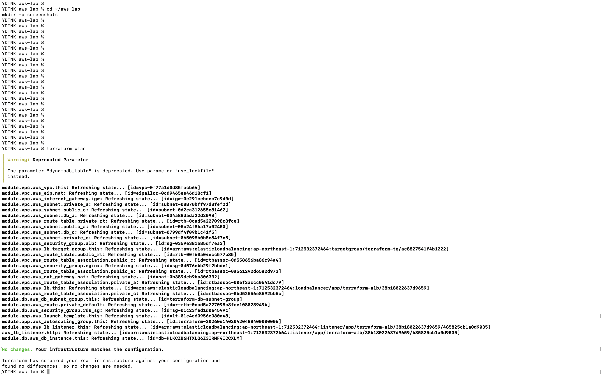
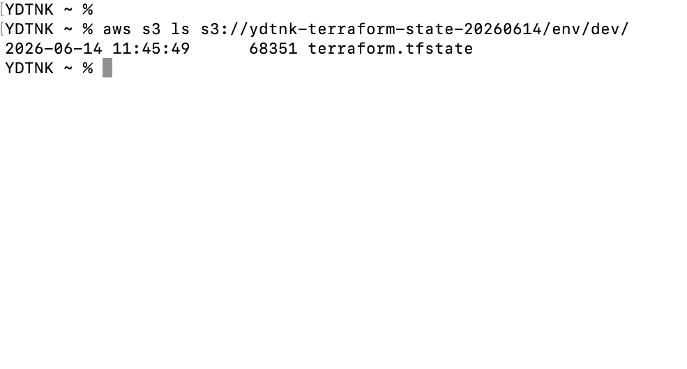
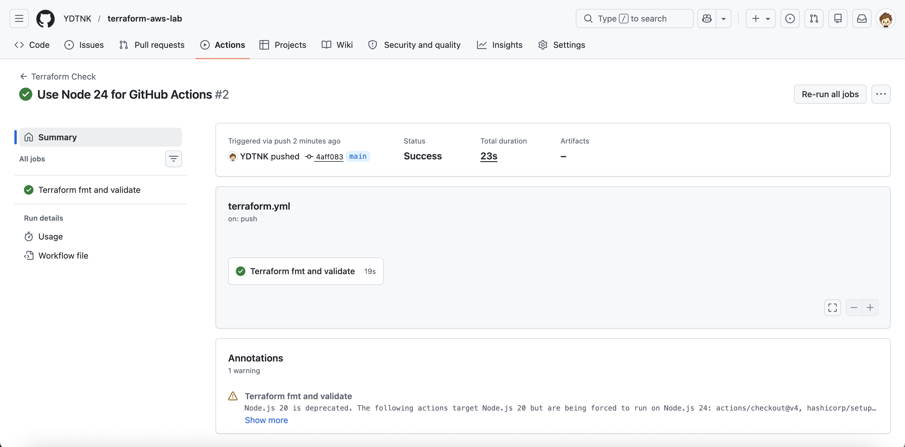

# Terraform AWS 3層Webアーキテクチャ構築

## プロジェクト概要

このリポジトリは、Terraformを用いてAWS上に3層Webアーキテクチャを構築する学習用ポートフォリオです。

単にAWSリソースを作成することではなく、以下を理解・説明できることを目的としています。

- VPC / Subnet / Route Table / Internet Gateway / NAT Gateway の役割
- ALB / Auto Scaling Group / EC2 の構成意図
- RDSをPrivateなネットワークに配置する理由
- Security Groupによる通信制御
- SSHを開放せずSSM Session Managerで管理接続する設計
- Terraform moduleによる構造化
- S3 Backend / State Lock によるRemote State管理
- GitHub ActionsによるTerraformコードの自動検証

---

## アーキテクチャ図

~~~mermaid
flowchart TB
    internet([Internet])

    subgraph vpc["VPC 10.0.0.0/16"]
        subgraph public["Public Subnet / Multi-AZ"]
            alb["Application Load Balancer"]
            nat["NAT Gateway"]
        end

        subgraph private["Private Subnet / Multi-AZ"]
            asg["Auto Scaling Group"]
            ec2a["EC2 / nginx AZ-A"]
            ec2c["EC2 / nginx AZ-C"]
            ssm["SSM Session Manager"]
        end

        subgraph db["DB Subnet / Multi-AZ"]
            rds["Amazon RDS MySQL"]
        end
    end

    internet --> alb
    alb --> asg
    asg --> ec2a
    asg --> ec2c
    ec2a --> rds
    ec2c --> rds
    ec2a --> nat
    ec2c --> nat
    ssm -. management access .-> ec2a
    ssm -. management access .-> ec2c
~~~

---

## ネットワーク構成

    VPC: 10.0.0.0/16

    Public Subnet
    - 10.0.1.0/24  ap-northeast-1a
    - 10.0.2.0/24  ap-northeast-1c
    - ALB
    - NAT Gateway

    Private Subnet
    - 10.0.11.0/24 ap-northeast-1a
    - 10.0.12.0/24 ap-northeast-1c
    - EC2 / Auto Scaling Group

    DB Subnet
    - 10.0.21.0/24 ap-northeast-1a
    - 10.0.22.0/24 ap-northeast-1c
    - RDS用Subnet

---

## 使用技術

| 種別 | 技術 |
|---|---|
| IaC | Terraform |
| Cloud | AWS |
| Network | VPC, Subnet, Route Table, Internet Gateway, NAT Gateway |
| Compute | EC2, Launch Template, Auto Scaling Group |
| Load Balancer | Application Load Balancer |
| Database | Amazon RDS for MySQL |
| Security | Security Group, IAM Role, IAM Instance Profile, SSM Session Manager |
| State管理 | S3 Backend, DynamoDB Lock |
| CI/CD | GitHub Actions |
| Region | ap-northeast-1 |

---

## ディレクトリ構成

    .
    ├── .github
    │   └── workflows
    │       └── terraform.yml
    ├── backend.tf
    ├── main.tf
    ├── outputs.tf
    ├── variables.tf
    ├── user_data.sh
    ├── screenshots
    │   ├── 01_terraform_plan_no_changes.png
    │   ├── 02_remote_state_s3.png
    │   └── 03_github_actions_success.png
    └── modules
        ├── vpc
        │   ├── main.tf
        │   └── outputs.tf
        ├── app
        │   ├── main.tf
        │   ├── outputs.tf
        │   ├── variables.tf
        │   └── userdata.sh
        └── db
            ├── main.tf
            ├── outputs.tf
            └── variables.tf

---

## 設計方針

### 1. Public Subnet

Public Subnetには、インターネットから直接アクセスを受ける必要があるALBと、Private Subnet内のEC2が外部通信するためのNAT Gatewayを配置しています。

EC2やRDSをPublic Subnetに置かないことで、外部からの直接アクセスを避ける構成にしています。

### 2. Private Subnet

Private Subnetには、Auto Scaling Group配下のEC2を配置しています。

ユーザーからの通信は直接EC2へ到達せず、必ず以下の経路を通ります。

    User → ALB → Target Group → EC2

これにより、EC2を直接インターネットに公開せずにWebサーバとして利用できます。

また、EC2への管理接続はSSHではなく、SSM Session Managerを前提としています。  
Security GroupでSSH 22番を開放せず、IAM Role / IAM Instance Profileを利用してSSM経由で管理できる構成にしています。

### 3. DB Subnet

RDS用にDB Subnetを分離しています。

RDSは `publicly_accessible = false` とし、インターネットから直接アクセスできない構成にしています。

通信はSecurity Groupにより、アプリケーション用EC2からのMySQL通信のみ許可しています。

    EC2 Security Group → RDS Security Group : TCP 3306

---

## Security Group設計

### ALB Security Group

- Inbound
  - HTTP 80番を `0.0.0.0/0` から許可
- Outbound
  - 全許可

### EC2 / nginx Security Group

- Inbound
  - ALB Security GroupからHTTP 80番のみ許可
  - SSH 22番は許可しない
- Outbound
  - 全許可

EC2への管理接続はSSHではなく、SSM Session Managerを前提としています。  
そのため、EC2をPrivate Subnetに配置したまま、インターネットからのSSH接続を不要にしています。

### RDS Security Group

- Inbound
  - EC2 / nginx Security GroupからMySQL 3306番のみ許可
- Outbound
  - 全許可

---

## IAM / SSM Session Manager設計

Auto Scaling Group配下のEC2には、SSM Session Managerを利用するためのIAM RoleとIAM Instance Profileを付与しています。

app moduleでは以下を構成しています。

- EC2用IAM Role
- `AmazonSSMManagedInstanceCore` の付与
- IAM Instance Profile
- Launch TemplateへのInstance Profile設定

これにより、SSHポートを開放せずにEC2を管理できる構成にしています。

Private Subnet内のEC2はNAT Gateway経由でSSMのパブリックエンドポイントへ通信します。  
そのため、現時点ではSSM用VPC Endpointは追加していません。

---

## Terraform Module構成

この構成では、Terraformコードを以下の3つのmoduleに分割しています。

### vpc module

- VPC
- Public Subnet
- Private Subnet
- DB Subnet
- Internet Gateway
- NAT Gateway
- Route Table
- Route Table Association

### app module

- Application Load Balancer
- Target Group
- Listener
- Launch Template
- Auto Scaling Group
- Security Group
- IAM Role / Instance Profile for SSM

### db module

- RDS MySQL
- DB Subnet Group
- RDS Security Group

module化することで、ネットワーク・アプリケーション・データベースの責務を分離しています。

---

## Remote State

Terraform stateはローカルではなく、S3 Backendで管理しています。

    terraform {
      backend "s3" {
        bucket         = "ydtnk-terraform-state-20260614"
        key            = "env/dev/terraform.tfstate"
        region         = "ap-northeast-1"
        dynamodb_table = "terraform-state-lock"
        encrypt        = true
      }
    }

### Remote Stateを使う理由

- stateファイルの紛失を防ぐ
- 複数端末・複数人での作業に対応しやすくする
- state lockにより同時実行による破損を防ぐ
- 将来的なCI/CD連携の土台にする

---

## 変数管理

RDSパスワードはコードへ直書きせず、`sensitive = true` を付与したTerraform変数として扱っています。

    variable "db_password" {
      type        = string
      description = "Password for the RDS MySQL instance"
      sensitive   = true
    }

実際の値は `terraform.tfvars` に記載し、`.gitignore` によりGit管理対象外にしています。

    *.tfvars
    *.tfvars.json

これにより、GitHub上のTerraformコードにRDSパスワードを直接含めない構成にしています。

---

## GitHub Actions

GitHub Actionsにより、Terraformコードの基本的な検証を自動化しています。

現在は以下を実行します。

- `terraform fmt -recursive -check`
- `terraform init -backend=false`
- `terraform validate`

Remote StateやAWS実環境へ接続する `terraform plan` は、AWS認証設定が必要になるため現時点では自動化対象外です。

今後はOIDCなどを利用して、AWS認証を安全に扱ったうえで `terraform plan` の自動化を検討します。

---

## 実行手順

### 初期化

    terraform init

### フォーマット

    terraform fmt -recursive

### 構文確認

    terraform validate

### 差分確認

    terraform plan

### 適用

    terraform apply

### 削除

    terraform destroy

---

## 動作確認

### Terraform差分確認

    terraform plan

確認結果：

    No changes. Your infrastructure matches the configuration.

### Remote State確認

    aws s3 ls s3://ydtnk-terraform-state-20260614/env/dev/

確認結果：

    terraform.tfstate

### ALB DNS確認

    terraform output alb_dns

ALBのDNS名へHTTPアクセスすることで、Auto Scaling Group配下のEC2で起動したnginxへ到達できることを確認します。

### SSM管理対象確認

    aws ssm describe-instance-information \
      --region ap-northeast-1 \
      --query "InstanceInformationList[*].[InstanceId,PingStatus,PlatformName]"

確認結果：

    i-0142cd2737f820492  Online  Amazon Linux

### Security Group確認

EC2 / nginx Security Groupでは、SSH 22番を許可せず、ALB Security GroupからのHTTP 80番のみを許可しています。

    TCP 80 from ALB Security Group

### Auto Scaling Group Instance Refresh確認

Launch TemplateへSSM用Instance Profileを追加した後、Auto Scaling GroupのInstance Refreshにより新しいLaunch TemplateのEC2へ入れ替えました。

確認結果：

    Successful / 100

---

## スクリーンショット

### Terraform plan

### Remote State

### GitHub Actions

---

## 学習したこと

このプロジェクトを通じて、以下を学習しました。

- Default VPCに依存しないVPC構築
- Public / Private / DB Subnetの役割分離
- ALBをPublic Subnetに配置する理由
- EC2をPrivate Subnetに配置する理由
- RDSをPublicにしない理由
- Security Groupによる通信制御
- SSH 22番を開けず、SSM Session Managerで管理接続する構成
- Auto Scaling GroupとLaunch Templateの基本構成
- Launch Template更新後にASG Instance RefreshでEC2を入れ替える流れ
- Terraform moduleによるコード構造化
- S3 BackendとDynamoDB LockによるRemote State管理
- `terraform plan` による差分確認の重要性
- GitHub ActionsによるTerraformコードの自動検証
- 機密値をTerraform変数化し、GitHubに直接含めない管理方法

---

## 既知の改善点

現時点では学習用構成として完成していますが、実務構成に近づけるために以下の改善余地があります。

### 1. DB Subnet Groupの整理

既存RDSのSubnet利用状況を考慮し、DB Subnet GroupにはPrivate SubnetとDB Subnetの両方を含めています。  
将来的にはRDSの再作成または移行により、DB Subnet専用構成へ整理する余地があります。

### 2. backend設定の更新

Terraformのバージョンによっては、`dynamodb_table` に非推奨警告が表示されます。  
今後はS3 backendのlockfile方式など、新しい方式への移行も検討します。

### 3. GitHub Actionsでのterraform plan自動化

現在はGitHub Actionsで `terraform fmt` と `terraform validate` を自動化しています。  
今後はOIDCなどを利用してAWS認証を安全に扱い、`terraform plan` の自動化を検討します。

### 4. Secret管理の実務化

RDSパスワードは直書きからTerraform変数へ改善済みですが、より実務に近づける場合は以下の利用を検討します。

- AWS Secrets Manager
- SSM Parameter Store
- CI/CD上での安全なSecret注入

### 5. SSM用VPC Endpointの追加

現在はPrivate SubnetのEC2がNAT Gateway経由でSSMのパブリックエンドポイントへ通信する構成です。  
より閉じたネットワーク構成にする場合は、以下のVPC Endpoint追加を検討します。

- ssm
- ssmmessages
- ec2messages

---

## まとめ

このプロジェクトでは、AWS上に3層WebアーキテクチャをTerraformで構築しました。

単なるリソース作成ではなく、ネットワーク分離、Security Group設計、Auto Scaling、RDS配置、Remote State管理、GitHub Actionsによる自動検証、SSM Session Managerによる管理接続まで含めて、実務に近いIaC構成を意識しています。

今後はDB Subnet Groupの整理、backend設定の更新、terraform planのCI自動化、Secret管理の実務化、SSM用VPC Endpoint追加などを通じて、より実務レベルのTerraformプロジェクトへ発展させます。
